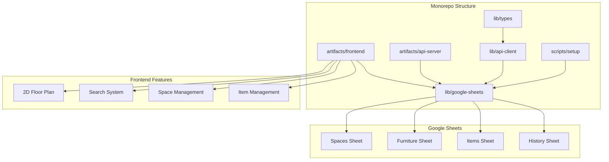

# StorageMap 벤치마킹 비교 분석

## 📊 세 프로젝트 비교

| 항목 | 현재 프로젝트 | storagemap-v2-2d | Storage-Map-1 |
|------|-------------|------------------|---------------|
| **아키텍처** | 단일 프로젝트 | 단일 프로젝트 | Monorepo (pnpm) |
| **프론트엔드** | Vanilla JS | React + TS | React + TS |
| **백엔드** | Express | tRPC + Express | Express + API |
| **데이터베이스** | Google Sheets | MySQL + Drizzle | PostgreSQL + Drizzle |
| **API 방식** | REST API | tRPC | REST + OpenAPI |
| **빌드** | 없음 | Vite | esbuild + Vite |

## 🎯 Storage-Map-1 핵심 벤치마킹 포인트

### 1. **Monorepo 구조**
```yaml
# pnpm-workspace.yaml
packages:
  - 'artifacts/*'     # 배포 가능한 앱
  - 'lib/*'          # 공유 라이브러리
  - 'scripts/*'      # 유틸리티 스크립트
```

**장점:**
- 코드 재사용성 극대화
- 타입 세이프한 공유 라이브러리
- 일관된 빌드 및 테스트

### 2. **OpenAPI 기반 코드 생성**
```typescript
// lib/api-spec/openapi.yaml에서 자동 생성
// 1. React Query hooks (lib/api-client-react)
// 2. Zod 스키마 (lib/api-zod)

// 자동 생성된 훅 사용
const { data: spaces } = useListSpaces();
const createSpaceMutation = useCreateSpaceMutation();
```

**장점:**
- API와 프론트엔드 타입 일치
- 자동 코드 생성으로 개발 생산성 향상
- API 명세 자동화

### 3. **고급 2D 평면도 구현**
```typescript
// FloorPlan.tsx - 완벽한 드래그 기능
function FurnitureMarker({ furniture, onUpdate }) {
  const [isDragging, setIsDragging] = useState(false);
  
  const handleMouseDown = (e) => {
    setIsDragging(true);
    // 드래그 시작 로직
  };
  
  return (
    <div
      className="absolute cursor-move"
      style={{
        left: furniture.posX,
        top: furniture.posY,
        width: furniture.width,
        height: furniture.height
      }}
      onMouseDown={handleMouseDown}
    >
      {/* 가구 마커 */}
    </div>
  );
}
```

### 4. **데이터베이스 스키마 (PostgreSQL + Drizzle)**
```typescript
// lib/db/src/schema/furniture.ts
export const furnitureTable = pgTable('furniture', {
  id: serial('id').primaryKey(),
  spaceId: integer('space_id').references(() => spacesTable.id),
  name: text('name').notNull(),
  type: text('type'),
  posX: integer('pos_x').default(50),
  posY: integer('pos_y').default(50),
  width: integer('width').default(100),
  height: integer('height').default(60),
  zonesJson: json('zones_json'),
  notes: text('notes'),
  createdAt: timestamp('created_at').defaultNow(),
  updatedAt: timestamp('updated_at').defaultNow()
});
```

### 5. **페이지 라우팅 구조**
```typescript
// App.tsx - wouter 기반 라우팅
function Router() {
  return (
    <Switch>
      <Route path="/" component={Home} />           // 검색 홈
      <Route path="/spaces" component={Spaces} />   // 공간 관리
      <Route path="/spaces/:spaceId/map" component={FloorPlan} /> // 평면도
      <Route path="/items" component={Items} />     // 전체 물건
    </Switch>
  );
}
```

## 🚀 Google Sheets 기반으로 적용할 아이디어

### 1. **Monorepo 구조 + Google Sheets**
```
storagemap-monorepo/
├── artifacts/
│   ├── frontend/          # React + Vite
│   └── api-server/        # Express + Google Sheets
├── lib/
│   ├── google-sheets/     # Google Sheets 서비스
│   ├── api-client/        # API 클라이언트
│   └── types/            # 공유 타입
└── scripts/
    └── setup-sheets.ts    # Google Sheets 초기화
```

### 2. **Google Sheets 라이브러리 모듈화**
```typescript
// lib/google-sheets/src/services.ts
export class GoogleSheetsService {
  private sheets: sheets_v4.Sheets;
  private spreadsheetId: string;
  
  // Spaces CRUD
  async getSpaces(): Promise<Space[]> { ... }
  async createSpace(space: CreateSpaceDto): Promise<Space> { ... }
  
  // Furniture CRUD
  async getFurnitureBySpace(spaceId: string): Promise<Furniture[]> { ... }
  async updateFurniturePosition(id: string, x: number, y: number): Promise<void> { ... }
  
  // Items CRUD
  async searchItems(query: string): Promise<Item[]> { ... }
  async createItem(item: CreateItemDto): Promise<Item> { ... }
}
```

### 3. **타입 세이프한 API 클라이언트**
```typescript
// lib/api-client/src/generated.ts
export const useListSpaces = () => {
  return useQuery({
    queryKey: ['spaces'],
    queryFn: () => googleSheetsService.getSpaces()
  });
};

export const useCreateSpace = () => {
  return useMutation({
    mutationFn: (space: CreateSpaceDto) => googleSheetsService.createSpace(space),
    onSuccess: () => queryClient.invalidateQueries(['spaces'])
  });
};
```

### 4. **Google Sheets 기반 데이터 훅**
```typescript
// hooks/useGoogleSheetsData.ts
export const useGoogleSheetsData = () => {
  const spacesQuery = useListSpaces();
  const furnitureQuery = useListFurnitureBySpace(selectedSpaceId);
  const itemsQuery = useListItems();
  
  // 실시간 데이터 동기화
  useEffect(() => {
    const interval = setInterval(() => {
      spacesQuery.refetch();
      furnitureQuery.refetch();
      itemsQuery.refetch();
    }, 30000); // 30초마다
    
    return () => clearInterval(interval);
  }, []);
  
  return { spacesQuery, furnitureQuery, itemsQuery };
};
```

### 5. **Google Sheets 초기화 스크립트**
```typescript
// scripts/setup-sheets.ts
export async function setupGoogleSheets() {
  const sheets = new GoogleSheetsService();
  
  // 시트 생성 및 헤더 설정
  await sheets.createSheet('Spaces', ['space_id', 'name', 'description']);
  await sheets.createSheet('Furniture', ['furniture_id', 'space_id', 'name', 'type', 'pos_x', 'pos_y', 'width', 'height']);
  await sheets.createSheet('Items', ['item_id', 'name', 'furniture_id', 'category', 'tags', 'memo', 'quantity']);
  await sheets.createSheet('History', ['history_id', 'item_id', 'from_furniture', 'to_furniture', 'moved_at', 'note']);
  
  console.log('Google Sheets 초기화 완료');
}
```

## 💡 최종 권장 아키텍처



## 🎯 구체적 마이그레이션 계획

### Phase 1: Monorepo 구조 도입 (1주)
1. pnpm workspace 설정
2. 기본 라이브러리 구조 생성
3. Google Sheets 서비스 모듈화

### Phase 2: API 클라이언트 생성 (1주)
1. Google Sheets 기반 API 서비스
2. React Query 훅 자동화
3. 타입 세이프한 통신

### Phase 3: 프론트엔드 마이그레이션 (2주)
1. Storage-Map-1의 컴포넌트 이식
2. 2D 평면도 기능 적용
3. 페이지 라우팅 구현

### Phase 4: 고급 기능 (2주)
1. 실시간 동기화
2. 데이터 품질 대시보드
3. 성능 최적화

## 📋 장단점 분석

### Storage-Map-1 장점
✅ 완벽한 Monorepo 구조  
✅ OpenAPI 기반 코드 생성  
✅ 고급 2D 평면도 구현  
✅ PostgreSQL 기반 안정성  

### Google Sheets 기반 장점
✅ 데이터 관리 편의성  
✅ 실시간 협업 가능  
✅ 비용 효율성  
✅ 접근성 뛰어남  

### 🎯 최종 제안
**Storage-Map-1의 아키텍처 + Google Sheets의 데이터 편의성**

Monorepo 구조와 코드 생성 방식은 유지하되, 데이터베이스 레이어만 Google Sheets로 교차하는 하이브리드 접근!
